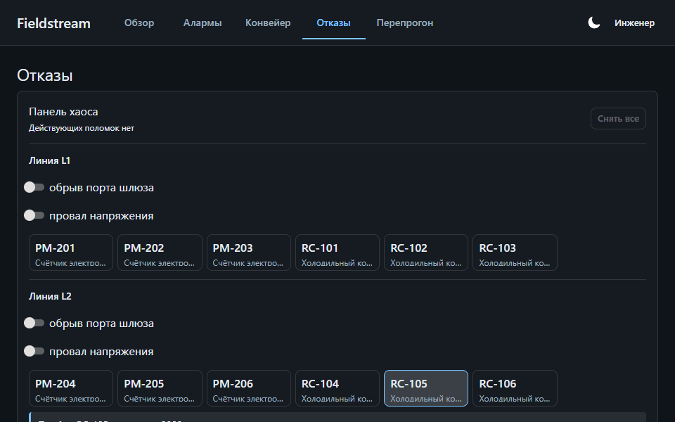
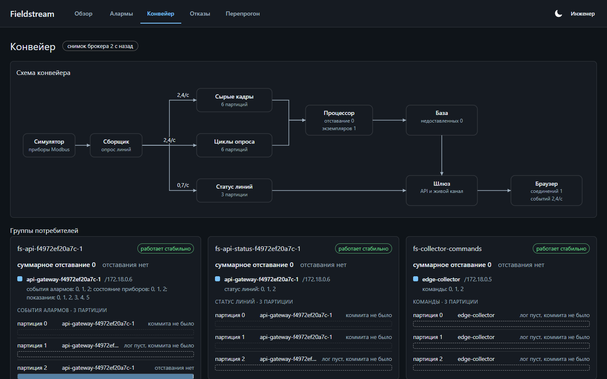
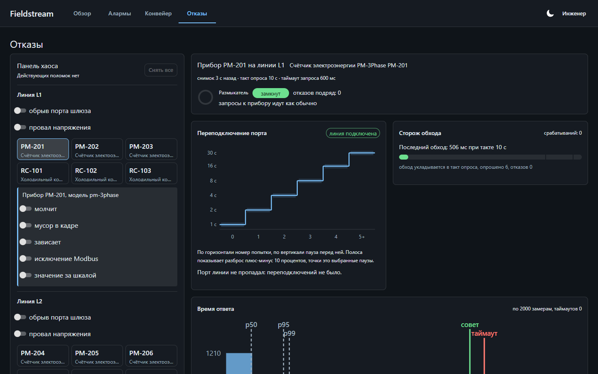
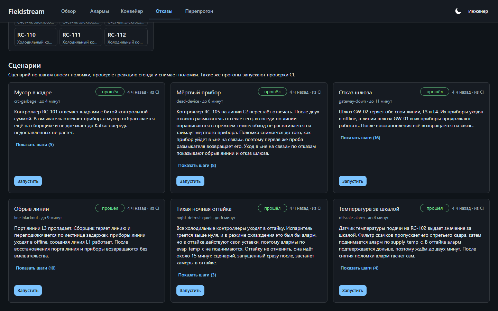
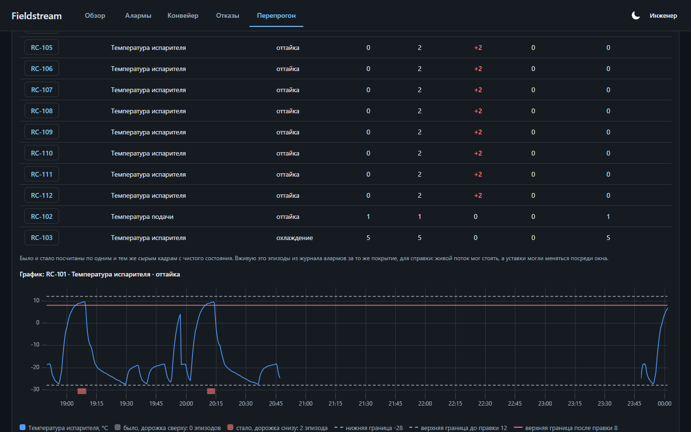

# Fieldstream

[](../../actions/workflows/checks.yml)
[](../../actions/workflows/e2e.yml)

Платформа сбора телеметрии с промышленных приборов: **Modbus TCP → Kafka → TimescaleDB → React**.
Поднимается одной командой, железо не нужно (приборы эмулирует отдельный сервис, говорящий по настоящему протоколу).

Демо-стенд: сеть холодильного оборудования, 24 прибора на 4 последовательных линиях за 2 шлюзами.

> **Статус: в разработке.** Путь от прибора до экрана проходит целиком. Что ещё не сделано,
> перечислено в конце.


Снимает их сам стенд: `pnpm --filter @fieldstream/web run shots` проходит по экранам
и складывает результат в `docs/media`.

| Обзор стенда                                                                         | Прибор                                                                                         |
| ------------------------------------------------------------------------------------ | ---------------------------------------------------------------------------------------------- |
| [](docs/media/overview.png)                         | [](docs/media/device.png)                                      |
| Сводка, дерево площадки и возраст данных. Живой канал правит числа без перезапросов. | График с полосой режимов: подъём температуры объяснён оттайкой, а не выглядит отказом датчика. |

| Уставки по режимам                                                       | Лента алармов                                                                            |
| ------------------------------------------------------------------------ | ---------------------------------------------------------------------------------------- |
| [](docs/media/rules.png)                 | [](docs/media/alarms.png)                                |
| В оттайке границы шире, рядом журнал правок с прежним и новым значением. | Значение рядом с уставкой, подтверждение без ожидания ответа, фильтры в адресе страницы. |



| Конвейер                                                                                                           | Отказы                                                                                                       |
| ------------------------------------------------------------------------------------------------------------------ | ------------------------------------------------------------------------------------------------------------ |
| [](docs/media/pipeline.png)                                                    | [](docs/media/lab.png)                                                          |
| Kafka изнутри: группы потребителей с раскладкой партиций, отставание по каждой партиции, ребалансы и темп топиков. | Поломки из интерфейса и защита сборщика: размыкатель, лестница переподключения, сторож обхода, время ответа. |

[](docs/media/scenarios.png)

Сценарии стенда на том же экране: поломка, ожидаемая реакция системы по шагам и бейдж последнего
прогона. Кнопка и CI запускают их одним и тем же путём.

[](docs/media/replay.png)

Перепрогон: правка уставки проверяется на сырых кадрах из Kafka до того, как её вносить. Таблица
показывает, какие срабатывания правка добавила и какие убрала, график рисует их полосами на
кривой параметра.

---

## Запуск

Нужны Docker, Node 22 и pnpm 10.

```bash
cp .env.example .env  # заполнить пустые значения: пароли базы и секрет AUTH_SECRET
pnpm stack:up         # Kafka, TimescaleDB, топики, миграции, засев истории и все сервисы
pnpm stack:scale      # второй экземпляр процессора: на экране Конвейер виден ребаланс
pnpm scenarios:ci     # сценарии стенда по очереди, тем же путём, что кнопка в интерфейсе
pnpm stack:down       # снести стенд
```

Интерфейс открывается на <http://localhost:8080>: это единственный вход в систему. Nginx отдаёт
статику и проксирует `/api` в шлюз, поэтому браузер работает в одном origin, без CORS и без
возни с куками между портами. Шлюз и база наружу не открыты, а брокер и симулятор приборов
слушают только 127.0.0.1: к ним можно обратиться для отладки с этой же машины.

Пока засев истории идёт, интерфейс не показывает пустые экраны: на входе видна панель
готовности со стадиями стенда, и она сама сменяется обзором, когда данные появились.

Учётные записи стенда заводит мигратор, пароль берётся из `DEMO_PASSWORD`:

| Кто                          | Что может                                                                                                  |
| ---------------------------- | ---------------------------------------------------------------------------------------------------------- |
| `viewer@fieldstream.local`   | только чтение, включая экраны Конвейер, Отказы и Перепрогон                                                |
| `engineer@fieldstream.local` | подтверждение алармов, уставки, команды, поломки стенда, сценарии, повторная подача из очереди, перепрогон |
| `admin@fieldstream.local`    | то же плюс управление правами                                                                              |

Сценарии стенда это YAML-файлы в `packages/scenarios/scenarios`: поломка и то, что стенд обязан
после неё показать. Один и тот же сценарий запускается кнопкой на экране Отказы и проверкой в CI,
прогон вносит настоящие поломки и идёт минутами.

Перепрогон отвечает на вопрос «что было бы с алармами при другой уставке». Процессор перечитывает
из Kafka сырые кадры выбранного окна: каждый кадр один раз проходит тот же разбор, а затем дважды
тот же движок алармов, с уставками на момент запроса и с правкой. Сравниваются эти два варианта на
одних и тех же кадрах, колонка «Вживую» из живого журнала алармов только для справки. История в базе
не переписывается, и кнопки «применить правку» нет. Пример на экране, граница испарителя в оттайке
+8 вместо +12, показывает, почему граница стоит на 12: змеевик в оттайке штатно греется до +10.

Засеянная неделя истории лежит только в базе, в Kafka её нет: перепрогнать можно только кадры,
которые стенд собрал сам, не старше семи суток (срок хранения сырого топика), поэтому на свежем
стенде кадры есть только с момента его подъёма. Как ставить прогон, в [docs/STAND.md](docs/STAND.md#перепрогон), как он
устроен, в [docs/ARCHITECTURE.md](docs/ARCHITECTURE.md#переигрывание-истории).

Что ещё умеет стенд: ломать приборы, смотреть внутренности сервисов, ходить в API руками,
работать без пересборки образов. Это в [docs/STAND.md](docs/STAND.md), а устройство системы
и причины решений в [docs/ARCHITECTURE.md](docs/ARCHITECTURE.md).

---

## Предметная область

Холодильные контроллеры и счётчики электроэнергии подключены по RS-485 к Ethernet-шлюзам, шлюз отдаёт Modbus TCP.

```
Site (SITE-A, SITE-B)
 └─ Gateway (GW-01, GW-02)
     └─ Line (L1..L4, baud 9600/19200, опрос 10 с, таймаут 600 мс)
         └─ Device (slaveId 1..8)
```

RS-485 это разделяемая линия: параллельные запросы в неё физически недопустимы, поэтому на линию приходится ровно один последовательный цикл опроса. Отсюда растёт почти вся инженерия проекта: воркер на линию, три предохранителя от зависания, размыкатель на конкретный прибор.

**Ключевая доменная деталь.** У камеры есть режимы `cooling`, `defrost`, `service`, `off`. Во время оттайки температура законно растёт на 6 и более градусов. Поэтому уставка хранится по ключу `(прибор, метрика, режим)`, а в режимах `service` и `off` алармы заглушены. Без этого аларм по верхней границе срабатывал бы на всём складе на каждой оттайке.

---

## Структура

```
packages/
  contracts/        zod-схемы всех сообщений и DTO, манифест топиков, типы через z.infer
  modbus-codec/     кодирование и декодирование регистров, четыре порядка байтов
  device-profiles/  описания моделей приборов, валидатор, план чтения, разбор кадра, симулятор
  domain/           алармы, дерево здоровья, детектор событий, фильтр скачков, порт времени
  kafka/            сообщения по манифесту, продюсер, очередь недоставленных, назначатель партиций
  db/               SQL-миграции, роли, топология, пакетная запись
  nest-common/      логгер и подавление дублей для сервисов на Nest
  scenarios/        сценарии стенда в YAML и их исполнитель
services/
  device-sim/       стенд приборов: Modbus TCP, физическая модель, API поломок
  edge-collector/   опрос линий, размыкатели, сырые кадры, циклы опроса и снимки линий в Kafka
  stream-processor/ разбор кадров, запись в TimescaleDB, алармы, здоровье, повторная подача из очереди, перепрогон
  api-gateway/      авторизация и права, REST, живой канал, команды, снимок конвейера, сценарии, перепрогон
apps/web/           React 19 SPA
infra/              общий Dockerfile, compose, создание топиков Kafka
tools/              границы зависимостей, конфиг топиков, засев истории, сценарии в CI
docs/               устройство системы, работа со стендом, записи о решениях
```

Границы зависимостей держатся на трёх уровнях: ссылки между проектами в компиляторе, зоны `no-restricted-imports` в линтере и `dependency-cruiser`, который запускается и обычным тестом (`tools/arch-check`), и отдельным шагом CI.

Тесты лежат в `test/` рядом с `src/` каждого пакета и сервиса и повторяют её структуру, интеграционные на настоящих контейнерах вынесены в `test/integration/`.

---

## Разработка

```bash
pnpm install
pnpm build            # turbo, сборка всех пакетов
pnpm test             # vitest по пакетам, включая проверку границ зависимостей
pnpm test:integration # база, процессор и шлюз на настоящих TimescaleDB и Kafka в контейнерах, нужен Docker
pnpm typecheck        # типы, включая тестовые файлы
pnpm lint             # eslint, включая тестовые файлы
pnpm format:check     # prettier
pnpm topics:gen       # пересобрать infra/kafka/topics.conf из манифеста топиков
```

Требуется Node 22 и pnpm 10.

---

## Дальше

- Полные записи о решениях: сейчас в `docs/adr` лежат 3 из 12, перечисленных в
  [docs/ARCHITECTURE.md](docs/ARCHITECTURE.md#решения-и-компромиссы).
- Замеры вместе с командами, которыми их можно повторить.
- Тетрадь экспериментов с Kafka.

---

## Демо-данные

Площадки, шлюзы, приборы и их коды вымышленные, адреса взяты из документационного диапазона RFC 5737. Физика и протокол настоящие: RS-485, Modbus и особенности опроса устроены именно так.

Лицензия MIT.
