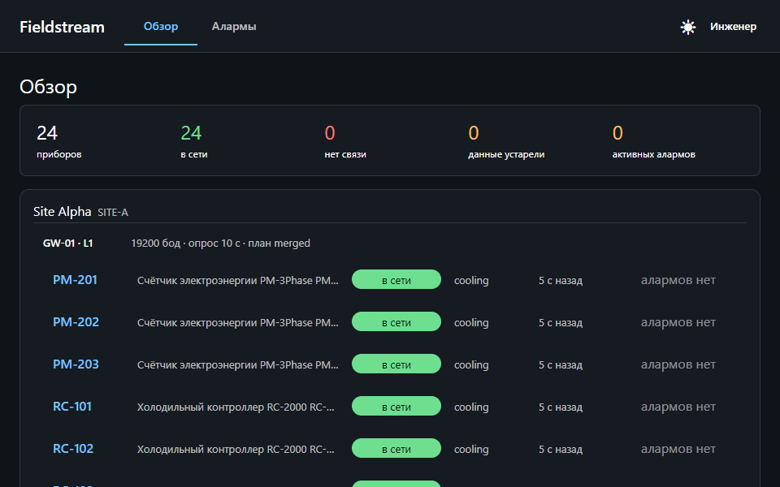
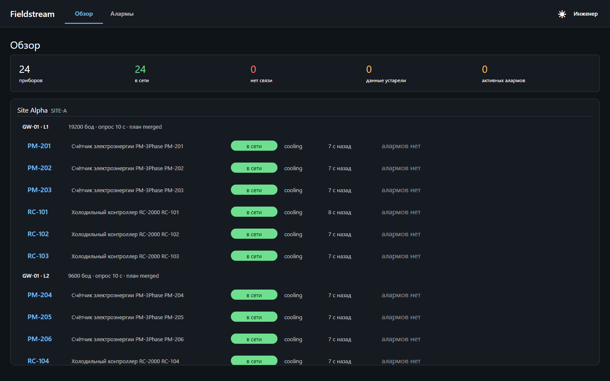
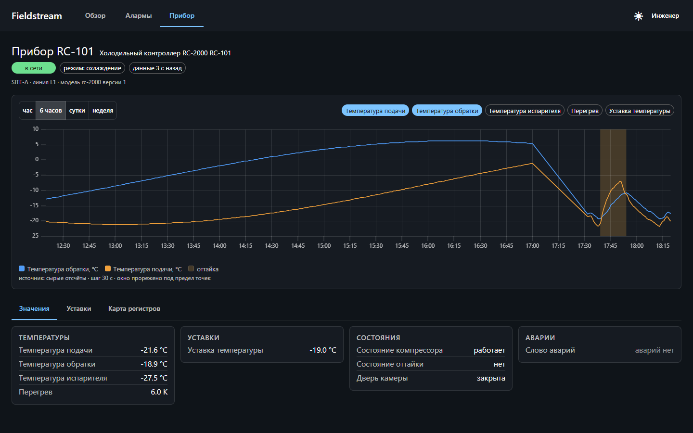
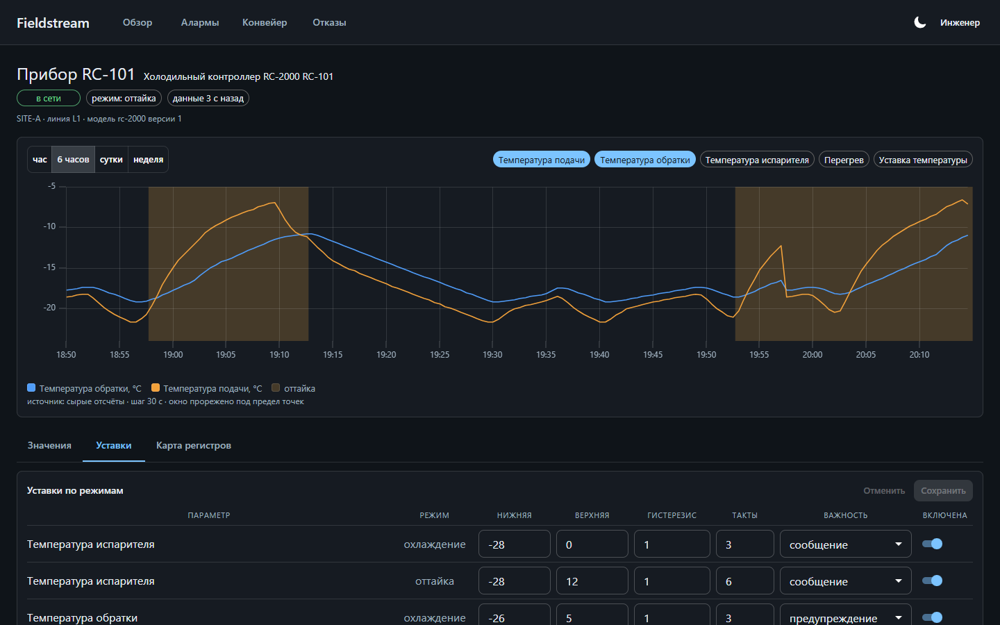
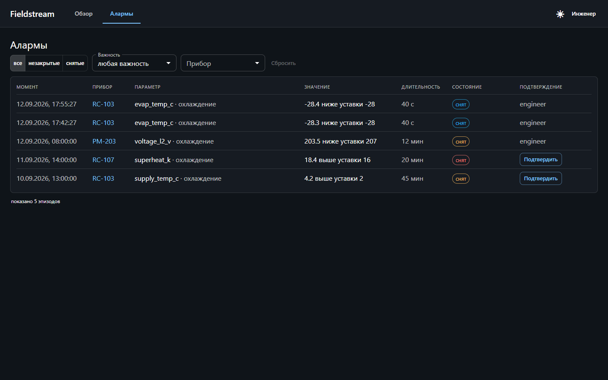

# Fieldstream

[](../../actions/workflows/checks.yml)

Платформа сбора телеметрии с промышленных приборов: **Modbus TCP → Kafka → TimescaleDB → React**.
Поднимается одной командой, железо не нужно (приборы эмулирует отдельный сервис, говорящий по настоящему протоколу).

Демо-стенд: сеть холодильного оборудования, 24 прибора на 4 последовательных линиях за 2 шлюзами.

> **Статус: в разработке.** Работает весь путь от прибора до экрана: симулятор, сборщик,
> процессор с алармами, база с историей, шлюз с авторизацией и живым каналом, интерфейс с
> обзором стенда, экраном прибора, уставками и лентой алармов. Дорожная карта ниже.



Картинки и ролик сняты с живого стенда автоматически: `pnpm --filter @fieldstream/web run shots`
проходит по экранам и складывает их в `docs/media`. Нарисованных вручную скриншотов в проекте
нет намеренно, иначе они устаревают молча.

| Обзор стенда                                                                         | Прибор                                                                                         |
| ------------------------------------------------------------------------------------ | ---------------------------------------------------------------------------------------------- |
| [](docs/media/overview.png)                         | [](docs/media/device.png)                                      |
| Сводка, дерево площадки и возраст данных. Живой канал правит числа без перезапросов. | График с полосой режимов: подъём температуры объяснён оттайкой, а не выглядит отказом датчика. |

| Уставки по режимам                                                       | Лента алармов                                                                            |
| ------------------------------------------------------------------------ | ---------------------------------------------------------------------------------------- |
| [](docs/media/rules.png)                 | [](docs/media/alarms.png)                                |
| В оттайке границы шире, рядом журнал правок с прежним и новым значением. | Значение рядом с уставкой, подтверждение без ожидания ответа, фильтры в адресе страницы. |

---

## Ключевые решения

Где в коде лежит самое содержательное, чтобы не искать по дереву.

| Что                                                                                                                  | Где                                                            |
| -------------------------------------------------------------------------------------------------------------------- | -------------------------------------------------------------- |
| Декларативный профиль прибора и автосборка плана блочного чтения                                                     | `packages/device-profiles/src/frames/read-plan.ts`             |
| Один кодек на запись и на чтение, round-trip по всем порядкам байтов                                                 | `packages/modbus-codec/src/`                                   |
| Уставки алармов по ключу (прибор, метрика, **режим**) с гистерезисом                                                 | `packages/domain/src/alarms.ts`                                |
| Дерево здоровья с машинной причиной статуса                                                                          | `packages/domain/src/health.ts`                                |
| Манифест топиков Kafka как единственный источник истины                                                              | `packages/contracts/src/kafka/topics.manifest.ts`              |
| Правило выбора источника серии вместо запроса без лимита                                                             | `packages/contracts/src/series.ts`                             |
| Свой сервер Modbus TCP стенда: очередь на линию, время кадра по скорости шины, поломки на уровне кадра               | `services/device-sim/src/modbus/`                              |
| Тепловая модель камеры (гистерезис, оттайка, дверь) и счётчик на вводе, повторяющий её нагрузку                      | `services/device-sim/src/physics/`                             |
| Конфиг создания топиков генерируется из манифеста и сверяется тестом                                                 | `tools/topic-matrix/`                                          |
| Воркер линии: таймаут библиотеки, жёсткий таймаут и сторож цикла, размыкатель на прибор, переподключение с джиттером | `services/edge-collector/src/polling/line-worker.ts`           |
| Буфер перед Kafka: опрос не ждёт брокер, при переполнении отбрасываются самые старые кадры                           | `services/edge-collector/src/publish/bounded-publisher.ts`     |
| Писать в топик может только его владелец из манифеста, схема проверяется на публикации                               | `packages/kafka/src/message.ts`                                |
| Гипертаблицы и иерархические агрегаты: хранятся сумма и число, а не среднее от средних                               | `packages/db/migrations/`                                      |
| Разбор кадра чистой функцией: состояние фильтров применяется только после записи, повтор пачки даёт тот же результат | `services/stream-processor/src/ingest/frame.ts`                |
| Временный сбой ставит партицию на паузу без подтверждения, неразбираемый кадр уходит в DLQ сырыми байтами            | `services/stream-processor/src/ingest/raw-consumer.service.ts` |
| Эпизод аларма одной строкой: ключ считается из времени кадра, идентификатор из ключа                                 | `packages/domain/src/alarm-key.ts`                             |
| Ротация токенов с окном повтора: потерянный ответ не разлогинивает, старый токен закрывает сессию                    | `services/api-gateway/src/auth/auth.service.ts`                |
| Кольцо живого канала: досылка по `Last-Event-ID` или явное требование перечитать всё                                 | `services/api-gateway/src/events/live-ring.ts`                 |
| Команды приборам через очередь исходящих в той же транзакции, что и приём                                            | `services/api-gateway/src/commands/outbox-relay.service.ts`    |
| Живое событие правит кэш экрана точечно, к сети идёт только требование перечитать всё                                | `apps/web/src/shared/sse/useLivePatch.ts`                      |
| Единая шкала времени во фронте: часы вкладки и сервера расходятся, «свежесть» считается по серверным                 | `apps/web/src/shared/time/serverClock.ts`                      |
| Единый вход: статика и `/api` с одного origin, у потока событий своя локация без буферизации                         | `infra/nginx/nginx.conf`                                       |

---

## Предметная область

Холодильные контроллеры и счётчики электроэнергии подключены по RS-485 к Ethernet-шлюзам, шлюз отдаёт Modbus TCP.

```
Site (SITE-A, SITE-B)
 └─ Gateway (GW-01, GW-02)
     └─ Line (L1..L4, baud 9600/19200, опрос 10 с, таймаут 600 мс)
         └─ Device (slaveId 1..8)
```

RS-485 это разделяемая линия: параллельные запросы в неё физически недопустимы, поэтому на линию приходится ровно один последовательный цикл опроса. Отсюда растёт почти вся инженерия проекта: воркер на линию, три предохранителя от зависания, размыкатель на конкретный прибор.

**Ключевая доменная деталь.** У камеры есть режимы `cooling`, `defrost`, `service`, `off`. Во время оттайки температура законно растёт на 6 и более градусов. Поэтому уставка хранится по ключу `(прибор, метрика, режим)`, а в режимах `service` и `off` алармы заглушены. Без этого аларм по верхней границе срабатывал бы на всём складе каждые сорок минут.

---

## Структура

```
packages/
  contracts/        zod-схемы всех сообщений и DTO, манифест топиков, типы через z.infer
  modbus-codec/     кодирование и декодирование регистров, четыре порядка байтов
  device-profiles/  описания моделей приборов, валидатор, план чтения, разбор кадра, симулятор
  domain/           алармы, дерево здоровья, детектор событий, фильтр скачков, порт времени
  kafka/            подготовка и разбор сообщений по манифесту, продюсер, очередь недоставленных
  db/               SQL-миграции, роли, топология, пакетная запись
  nest-common/      логгер и подавление дублей для сервисов на Nest
services/
  device-sim/       стенд приборов: Modbus TCP, физическая модель, API поломок
  edge-collector/   опрос линий, размыкатели, публикация сырых кадров и циклов опроса в Kafka
  stream-processor/ разбор кадров, запись в TimescaleDB, алармы, здоровье приборов, очередь недоставленных
  api-gateway/      авторизация и права, REST истории и алармов, живой канал, команды приборам
apps/web/           React 19 SPA
infra/              общий Dockerfile, compose, создание топиков Kafka
tools/              проверка границ зависимостей, генератор конфига топиков, засев истории
docs/ARCHITECTURE.md  полный инженерный план проекта
```

Границы зависимостей держатся на трёх уровнях: ссылки между проектами в компиляторе, зоны `no-restricted-imports` в линтере и `dependency-cruiser`, который запускается обычным тестом (`tools/arch-check`), а не отдельным шагом CI.

Тесты лежат в `test/` рядом с `src/` каждого пакета и сервиса и повторяют её структуру, интеграционные на настоящих контейнерах вынесены в `test/integration/`.

---

## Разработка

```bash
pnpm install
pnpm build            # turbo, сборка всех пакетов
pnpm test             # vitest по пакетам, включая проверку границ зависимостей
pnpm test:integration # база и процессор на настоящих TimescaleDB и Kafka в контейнерах, нужен Docker
pnpm typecheck        # типы, включая тестовые файлы
pnpm lint             # eslint, включая тестовые файлы
pnpm format:check     # prettier
pnpm topics:gen       # пересобрать infra/kafka/topics.conf из манифеста топиков
```

Требуется Node 22 и pnpm 10.

### Стенд целиком

```bash
cp .env.example .env  # задать пароли: POSTGRES_PASSWORD и три пароля ролей базы
pnpm stack:up         # Kafka, TimescaleDB, топики, миграции, засев истории и все сервисы
```

Интерфейс открывается на <http://localhost:8080>: это единственный вход в систему. Nginx отдаёт
статику и проксирует `/api` в шлюз, поэтому браузер работает в одном origin, без CORS и без
возни с куками между портами. Внутренние сервисы портов наружу не публикуют.

Пока засев истории идёт, интерфейс не показывает пустые экраны: на входе видна панель
готовности со стадиями стенда, и она сама сменяется обзором, когда данные появились.

Симулятор слушает Modbus TCP на портах 5020..5023 (линии L1..L4) и отдаёт управляющий API на порту 8090:

```bash
curl localhost:8090/sim/state
curl -X POST localhost:8090/sim/fault -H 'content-type: application/json' \
  -d '{"targetKind":"device","targetId":"RC-104","kind":"silent","ttlSec":120}'
curl -X POST localhost:8090/sim/scenario/night-defrost
curl -X DELETE localhost:8090/sim/faults
```

Виды поломок: `silent`, `crc`, `stall`, `exception`, `offline` (порт шлюза закрыт), `power_dip`, `offscale`, `door_stuck`, `defrost`. `GET /sim/state` отдаёт эталон: значения всех приборов, действующие поломки и счётчики запросов по линиям.

Сборщик опрашивает все четыре линии и пишет сырые кадры в `fieldstream.telemetry.raw.v1` (ключ это код прибора), а итог каждого обращения, в том числе неудачного, в `fieldstream.collector.cycles.v1`. Портов наружу у него нет, состояние воркеров, размыкателей и планов чтения смотрится изнутри сети:

```bash
docker compose -f infra/compose/docker-compose.yml exec edge-collector wget -qO- 127.0.0.1:8091/internal/lines
```

Процессор разбирает кадр той версией профиля, которой он прочитан, и пишет показания в `ts.readings`, итоги опроса в `ts.poll_cycles`, а состояние приборов в `core.device_state` и в компактируемый топик `fieldstream.device.state.v1`. Кадр, который не разобрать, уходит в `fieldstream.telemetry.raw.dlq.v1` сырыми байтами с исходным ключом, и поток идёт дальше. Минутный агрегат по прибору:

```bash
docker compose -f infra/compose/docker-compose.yml exec timescaledb psql -U fieldstream -d fieldstream \
  -c "select bucket, metric_key, round(avg_value::numeric, 2), n from ts.v_readings_1m where device_id = 1 order by bucket desc limit 9"
```

Шлюз слушает 8093 внутри сети, наружу его пути отдаёт nginx на 8080. Учётные записи стенда заводит мигратор, пароль берётся из `DEMO_PASSWORD`: `viewer@fieldstream.local` (только чтение), `engineer@fieldstream.local` (подтверждение алармов, уставки, команды), `admin@fieldstream.local`.

```bash
token=$(curl -s localhost:8080/api/auth/login -H 'content-type: application/json'   -d '{"email":"engineer@fieldstream.local","password":"fieldstream"}' | jq -r .accessToken)

curl -s localhost:8080/api/topology -H "authorization: Bearer $token"          # дерево объектов с состоянием
curl -s localhost:8080/api/devices/RC-101/latest -H "authorization: Bearer $token"
curl -s "localhost:8080/api/devices/RC-101/read-plan?mode=naive" -H "authorization: Bearer $token"
curl -s "localhost:8080/api/alarms?state=active" -H "authorization: Bearer $token"
```

Серия сама выбирает источник по ширине окна и говорит, откуда взяла числа: до шести часов это сырые строки, до недели минутный агрегат, дальше часовой. Источник, шаг и признак обрезки приходят вместе с данными, поэтому подпись под графиком не может разойтись с содержимым:

```bash
curl -s "localhost:8080/api/devices/RC-101/series?metrics=supply_temp_c&from=2026-09-05T00:00:00Z&to=2026-09-12T00:00:00Z"   -H "authorization: Bearer $token" | jq .meta
# {"source":"readings_1m","bucketMs":1260000,"points":480,"truncated":false, ...}
```

Живой канал это одно соединение на вкладку. Первым кадром приходит приветствие с серверным временем и эпохой, дальше показания, состояния приборов и алармы. При обрыве браузер присылает `Last-Event-ID`, и шлюз либо досылает пропущенное, либо честно требует перечитать всё:

```bash
curl -N "localhost:8080/api/events?keys=device:RC-101&access_token=$token"
```

Команда линии не уходит в брокер прямо из запроса: она ложится в очередь исходящих той же транзакцией, в которой её приняли, а отправкой занимается фоновая рассылка. Применяет её сборщик и отвечает через брокер, в таблицу ответ переносит процессор:

```bash
id=$(curl -s localhost:8080/api/commands -H "authorization: Bearer $token" -H 'content-type: application/json'   -d '{"lineCode":"L1","kind":"line.set_poll_interval","args":{"pollIntervalMs":15000}}' | jq -r .commandId)
curl -s localhost:8080/api/commands/$id -H "authorization: Bearer $token"
# {"stage":"applied","detail":"такт опроса линии L1 теперь 15000 мс", ...}
```

Историю на неделю назад заливает одноразовый контейнер: он поднимается вместе со стендом, а
повторить засев можно командой `pnpm stack:seed`. Строки не едут по сети, их порождает сама
база, поэтому неделя на 24 прибора занимает секунды. Повторный запуск ничего не добавляет и не
пишет поверх живых значений. В засеянной истории лежат три происшествия и оттайки по расписанию,
чтобы на экранах было что показывать.

Kafka доступна с хоста на `localhost:29092`, веб-интерфейс к ней поднимается профилем: `docker compose -f infra/compose/docker-compose.yml --profile tools up -d kafka-ui` (http://localhost:8081).

Для ежедневной разработки без пересборки образов `pnpm infra:up` поднимает брокер, базу и
применяет миграции, а `pnpm dev` запускает сервисы на хосте в режиме наблюдения за файлами
(переменные берутся из `.env`). В этом режиме фронт живёт на дев-сервере vite (5173) и ходит в
шлюз на 8093, то есть в два origin: `.env` для этого и держит `CORS_ORIGINS`.

Сценарии Playwright идут против поднятого стенда:

```bash
pnpm --filter @fieldstream/web exec playwright test          # против http://localhost:8080
E2E_BASE_URL=http://127.0.0.1:5173 pnpm --filter @fieldstream/web exec playwright test
```

По умолчанию сценарии берут установленный Chrome, чтобы не качать браузер ради локального
прогона. Пустая `E2E_CHANNEL` переключает их на браузер, который ставит сам Playwright.

Проверки собраны в два потока. Быстрый идёт на каждый пуш: сборка, типы, линтер, формат,
границы зависимостей и модульные тесты. Тяжёлый поднимает настоящие Kafka, TimescaleDB и весь
стенд в Docker, поэтому запускается по расписанию и по кнопке: интеграционные тесты и сценарии
интерфейса против контейнера.

---

## Замеры

Сняты на стенде из 24 приборов с тактом опроса 10 секунд, машина обычная рабочая (Windows, Docker с WSL2).

| Что                                        | Значение                           |
| ------------------------------------------ | ---------------------------------- |
| Засев недели истории в минутном разрешении | 1.69 млн строк за 9 секунд         |
| Сжатие TimescaleDB на засеянной неделе     | 179 МБ до, 7 МБ после, пять кусков |
| Память: сборщик / процессор / шлюз         | 78 / 84 / 80 МБ                    |
| Память: симулятор стенда                   | 28 МБ                              |
| Память: TimescaleDB / Kafka                | 626 МБ / 742 МБ                    |

Коэффициент сжатия честнее читать как порядок величины, а не как обещание: засеянные значения гладкие, настоящие данные сжимаются хуже. Мерится он по самим сжатым кускам, а не по всей гипертаблице, иначе горячие сутки и индексы занизили бы цифру вдвое.

---

## Дорожная карта

- [x] Каркас монорепы, контракты, кодек, профили приборов, доменная логика
- [x] `device-sim`: Modbus TCP серверы, тепловая модель, API инъекции неисправностей
- [x] `edge-collector`: воркер на линию, три предохранителя, размыкатель, публикация в Kafka
- [x] `stream-processor`: разбор кадров, идемпотентная запись в TimescaleDB, здоровье приборов, очередь недоставленных
- [x] Алармы по уставкам с учётом режима, `api-gateway`: авторизация, REST, SSE, команды приборам
- [x] Интерфейс: обзор стенда, экран прибора с графиком, уставки по режимам, лента алармов
- [x] Compose: Kafka, TimescaleDB, топики из манифеста, миграции, стенд, сборщик, процессор, шлюз
- [x] Единый вход через nginx: статика и API в одном origin, стенд поднимается одной командой
- [x] Засев истории и замеры
- [x] README с картинками и роликом работы стенда
- [ ] После публикации: экран Pipeline, Fault Lab, Replay Lab

---

## Демо-данные

Площадки, шлюзы, приборы и их коды вымышленные, адреса взяты из документационного диапазона RFC 5737. Физика и протокол настоящие: RS-485, Modbus и особенности опроса устроены именно так.

Лицензия MIT.
