# Fieldstream

[](../../actions/workflows/checks.yml)
[](../../actions/workflows/e2e.yml)

Платформа сбора телеметрии с промышленных приборов: **Modbus TCP → Kafka → TimescaleDB → React**. Поднимается одной командой, железо не нужно: приборы эмулирует отдельный сервис, говорящий по настоящему протоколу.
Демо-стенд: сеть холодильного оборудования, 24 прибора на 4 линиях за 2 шлюзами; снимки ниже
делает сам стенд (`pnpm --filter @fieldstream/web run shots` кладёт их в `docs/media`).

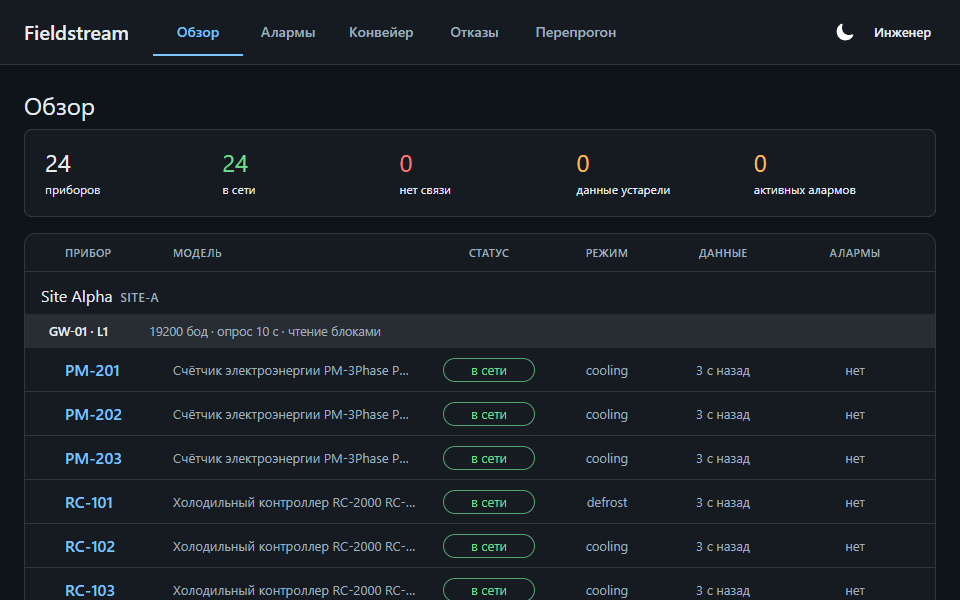

| Обзор стенда                                                                         | Прибор                                                                                         | Уставки по режимам                                                                     | Лента алармов                                                                            |
| ------------------------------------------------------------------------------------ | ---------------------------------------------------------------------------------------------- | -------------------------------------------------------------------------------------- | ---------------------------------------------------------------------------------------- |
| [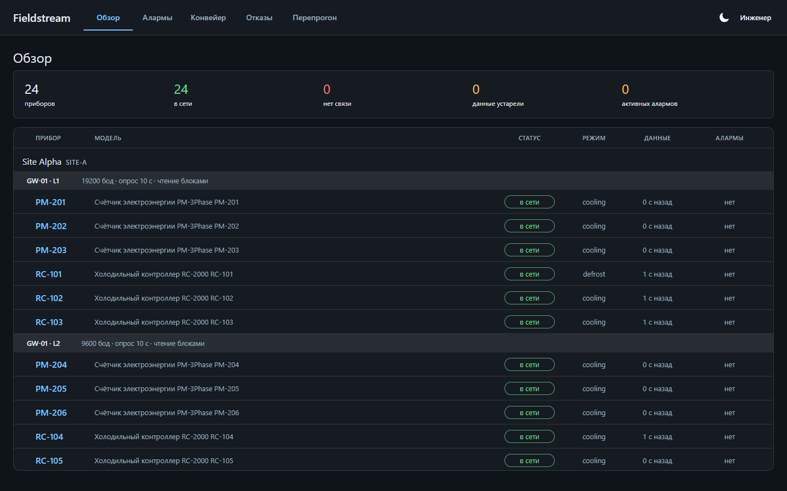](docs/media/overview.png)                         | [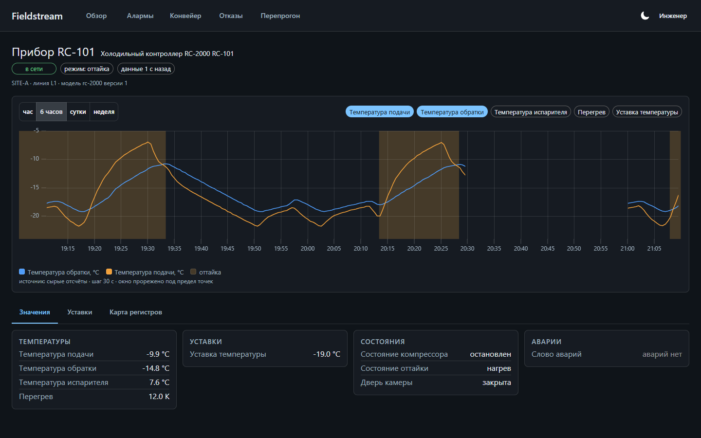](docs/media/device.png)                                      | [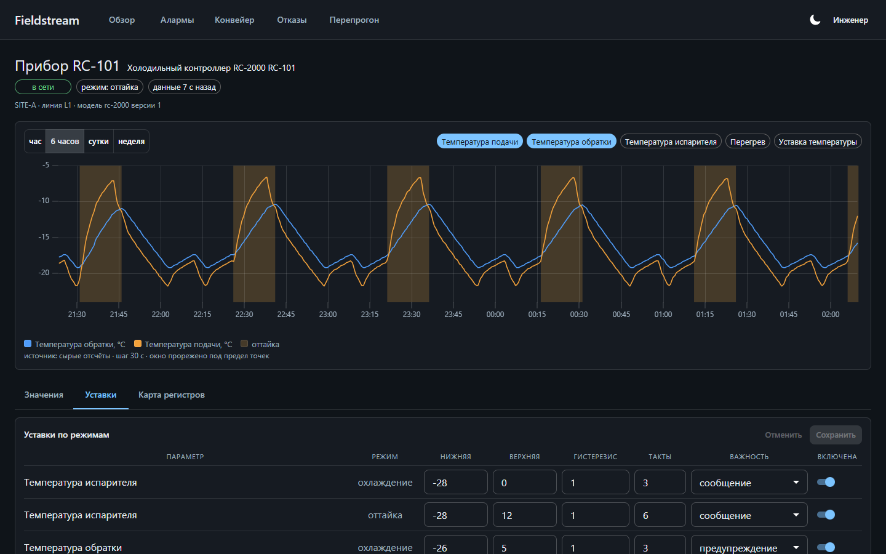](docs/media/rules.png)                               | [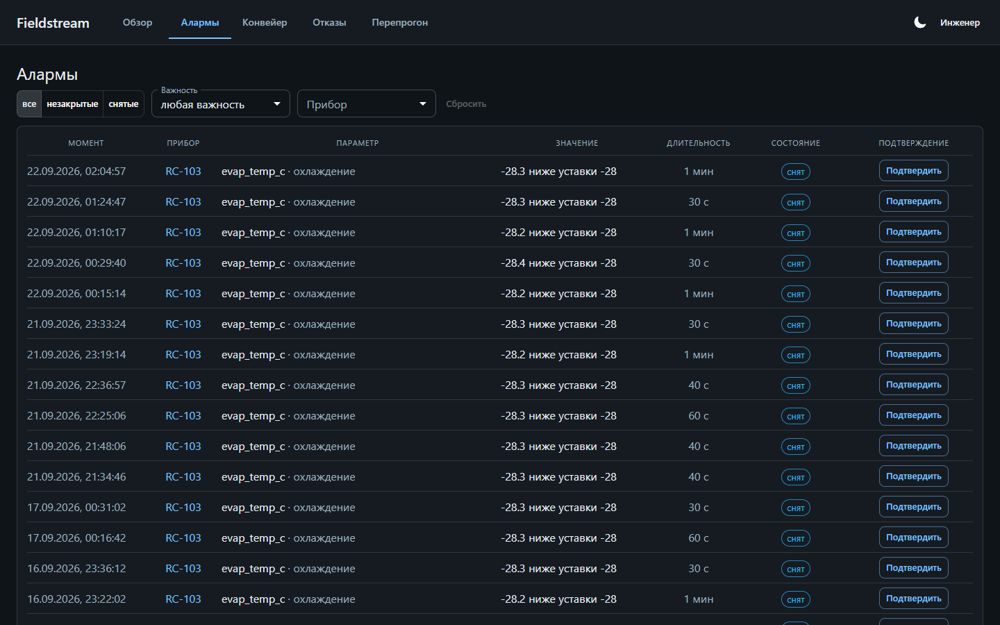](docs/media/alarms.png)                                |
| Сводка, дерево площадки и возраст данных; живой канал правит числа без перезапросов. | График с полосой режимов: подъём температуры объяснён оттайкой, а не выглядит отказом датчика. | Своя пара границ на охлаждение и на оттайку, гистерезис, выдержка в тактах и важность. | Значение рядом с уставкой, подтверждение без ожидания ответа, фильтры в адресе страницы. |

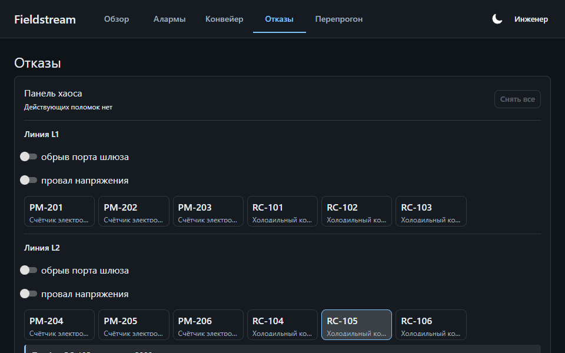

| Конвейер                                                                             | Отказы                                                                      | Первый подъём                                                                                              | Карта регистров                                                                                      |
| ------------------------------------------------------------------------------------ | --------------------------------------------------------------------------- | ---------------------------------------------------------------------------------------------------------- | ---------------------------------------------------------------------------------------------------- |
| [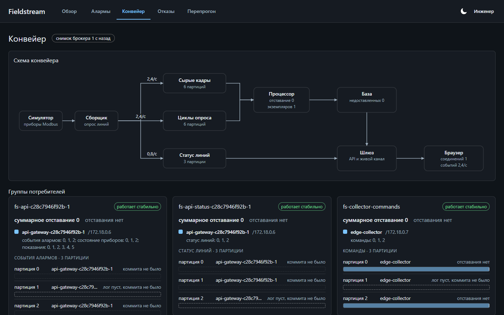](docs/media/pipeline.png)                      | [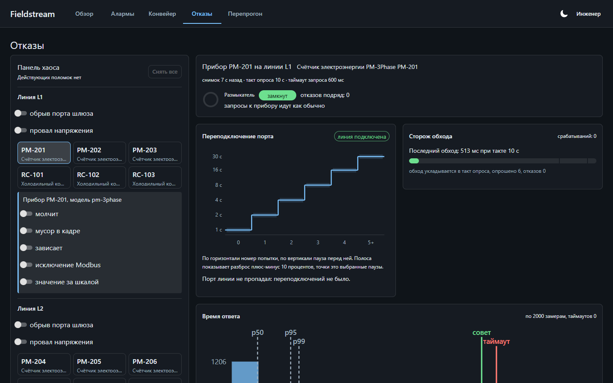](docs/media/lab.png)                         | [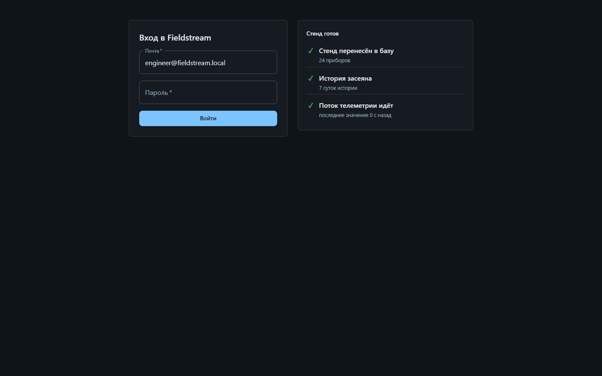](docs/media/login.png)                                  | [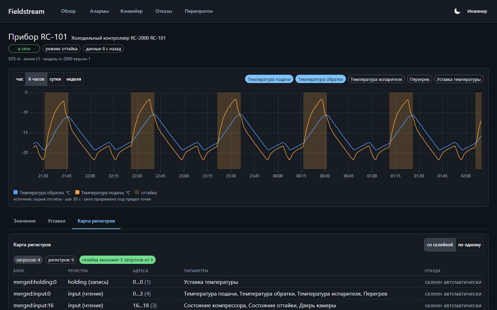](docs/media/read-plan.png)                             |
| Темп по топикам, группы потребителей с раскладкой партиций и очередь недоставленных. | Поломки из интерфейса, размыкатель, лестница переподключения, время ответа. | Рядом со входом панель подъёма: перенос топологии, глубина засеянной истории, возраст последнего значения. | Склейка соседних адресов: 4 запроса вместо 9 на контроллере, пять обращений экономятся каждый обход. |

| Сценарии стенда                                                                               | Перепрогон                                                                                    |
| --------------------------------------------------------------------------------------------- | --------------------------------------------------------------------------------------------- |
| [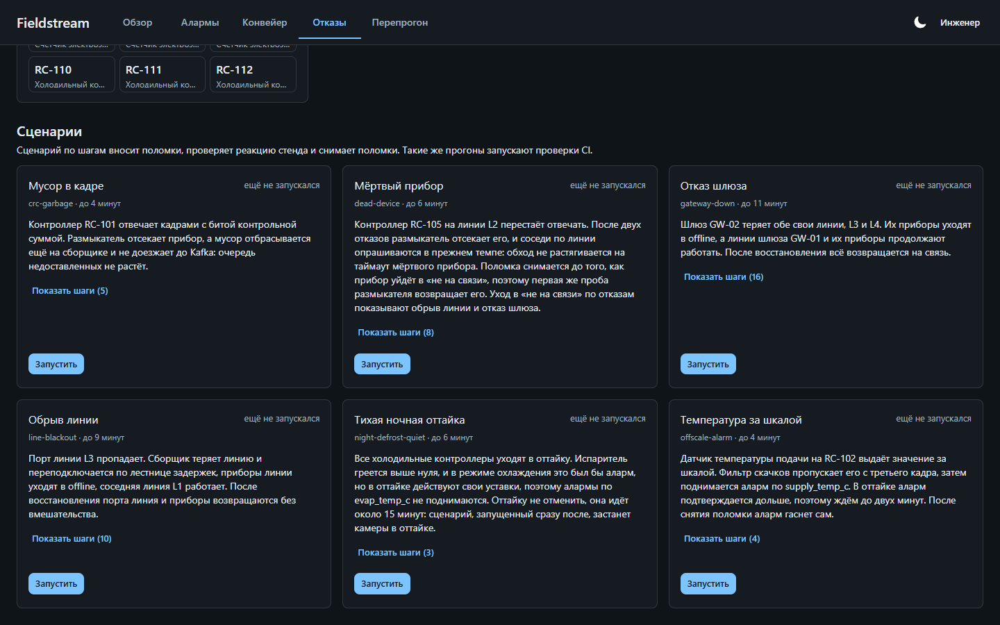](docs/media/scenarios.png)                             | [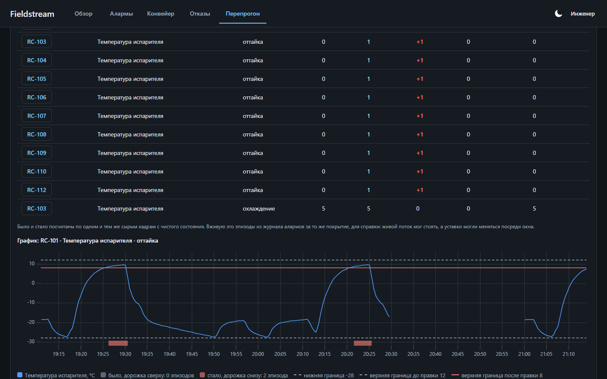](docs/media/replay.png)                                 |
| Поломка, ожидаемая реакция по шагам и бейдж последнего прогона; кнопка и CI идут одним путём. | Правка уставки проверяется на сырых кадрах до того, как её вносить: что добавилось, что ушло. |

## Запуск

Нужны Docker, Node 22 и pnpm 10.

```bash
git clone <репозиторий> && cd fieldstream
cp .env.example .env  # заполнить пустые значения: пароли базы и секрет AUTH_SECRET
pnpm stack:up         # Kafka, TimescaleDB, топики, миграции, засев истории и все сервисы
# дальше http://localhost:8080
```

Что видно в первые полторы минуты: на 12 секунде страница открывается и показывает панель
готовности, к 45 секундам графики нарисованы по засеянной неделе, к 90 секундам истекает окно
ожидания и дерево приборов зеленеет ([раскладка стадий](docs/ARCHITECTURE.md#docker)). Вход
`engineer@fieldstream.local`, пароль из `DEMO_PASSWORD` (в `.env.example` это `fieldstream`); `viewer@`
только читает, `engineer@` подтверждает алармы, правит уставки, шлёт команды, ломает стенд и гоняет
сценарии, `admin@` то же плюс полный набор. Экрана управления правами нет: `core.user_permissions`
меняется правкой в базе. Чего стоит поднятый стенд по памяти, образам и томам, сказано
строками таблицы в [docs/STAND.md](docs/STAND.md#замеры): эти числа растут вместе с возрастом стенда,
поэтому берутся прогоном `pnpm bench memory`, `images`, `volumes`.

```bash
pnpm stack:scale    # второй экземпляр процессора: на экране Конвейер виден ребаланс
pnpm scenarios:ci   # сценарии стенда по очереди, тем же путём, что кнопка в интерфейсе
pnpm stack:down     # снести стенд
```

Интерфейс открывается на <http://localhost:8080>, и это единственный вход в систему: nginx отдаёт
статику и проксирует `/api` в шлюз, поэтому браузер работает в одном origin, без CORS
([ADR 0012](docs/adr/0012-single-origin.md)). Шлюз и база наружу не открыты, брокер и симулятор слушают
только 127.0.0.1. Что ещё умеет стенд в [docs/STAND.md](docs/STAND.md), устройство системы и причины
решений в [docs/ARCHITECTURE.md](docs/ARCHITECTURE.md).

## Основные механизмы

Шесть мест, на которых держится система: по одной строке со ссылкой в код, подробности в ADR и в
устройстве системы.

- **Перепрогон уставки на сырых кадрах Kafka**, без правки истории:
  [`replay-core.ts`](services/stream-processor/src/replay/replay-core.ts),
  [ADR 0010](docs/adr/0010-replay-keeps-history.md), руками в [проверке 3](#3-перепрогон-уставки).
- **Идемпотентность ключом в схеме вместо транзакций брокера**, время берётся из кадра:
  [`writer.ts`](packages/db/src/store/writer.ts), [ADR 0004](docs/adr/0004-at-least-once.md).
- **Очередь недоставленных на сырых байтах**, диагностика в заголовках, возврат в ту же партицию:
  [`dlq.ts`](packages/kafka/src/dlq.ts), [проверка 2](#2-мусор-в-топике-очередь-недоставленных-и-повторная-подача).
- **Построитель плана чтения регистров**, 4 запроса вместо 9 у контроллера и 3 вместо 9 у счётчика:
  [`read-plan.ts`](packages/device-profiles/src/frames/read-plan.ts),
  [разбор](docs/ARCHITECTURE.md#построитель-плана-чтения).
- **Воркер на линию, три предохранителя и размыкатель** с редкой пробой по лестнице 30, 60, 120 с:
  [`breaker.ts`](services/edge-collector/src/breaker/breaker.ts), [проверка 1](#1-мёртвый-прибор-и-размыкатель).
- **Два уровня непрерывных агрегатов на сумме и количестве** и одно правило выбора источника:
  [`series.ts`](packages/contracts/src/series.ts), [ADR 0006](docs/adr/0006-continuous-aggregates.md).

## Проверки на стенде

Три проверки на поднятом стенде. Числа это прогон 21 сентября 2026 года: 24 прибора, такт опроса 10
секунд, обычная рабочая машина. Токен доступа живёт 10 минут (`ACCESS_TTL_MS`), а наблюдение в
проверке 1 идёт дольше, поэтому вход заведён функцией и повторяется, когда токен истёк.

```bash
login() {
  token=$(curl -s localhost:8080/api/auth/login -H 'content-type: application/json' \
    -d '{"email":"engineer@fieldstream.local","password":"fieldstream"}' | jq -r .accessToken); }
login
```

### 1. Мёртвый прибор и размыкатель

```bash
curl -s -X POST localhost:8090/sim/fault -H 'content-type: application/json' \
  -d '{"targetKind":"device","targetId":"RC-104","kind":"silent","ttlSec":180}'

curl -s localhost:8080/api/lab/lines -H "authorization: Bearer $token" | jq '.lines[]
  | select(.lineCode == "L2") | {lastCycle, breaker: (.devices[]
  | select(.deviceCode == "RC-104") | .breaker)}'
```

Повторяя последний запрос раз в десять секунд, видно всю лестницу: обход шести приборов до поломки
занимал 600 до 800 мс; первый после неё дал `failed: 1` и 1378 мс (сверху лёг таймаут 600 мс);
следующий это уже `state: "open"`, `probeDelayMs: 30000`; дальше линия опрашивает пятерых, и
длительность возвращается к 610 до 720 мс: мёртвый прибор больше не стоит в цикле у живых соседей; на
`nextProbeAt` состояние становится `half_open`, проба не проходит, пауза удваивается до 60, затем 120
секунд. Поломка снялась по сроку, но размыкатель замкнулся не в тот же миг, а на первой удачной пробе,
через 64 секунды. Наблюдение идёт дольше 10 минут, поэтому токен истечёт и `login` повторяют; снять
поломку раньше срока: `curl -X DELETE "localhost:8090/sim/faults?targetId=RC-104&kind=silent"`.

### 2. Мусор в топике, очередь недоставленных и повторная подача

```bash
docker exec -i fieldstream-kafka-1 sh -c 'echo "RC-101:not-a-frame" | \
  /opt/kafka/bin/kafka-console-producer.sh --bootstrap-server localhost:9092 \
  --topic fieldstream.telemetry.raw.v1 --property parse.key=true --property key.separator=:'

curl -s "localhost:8080/api/dlq?limit=5" -H "authorization: Bearer $token" | jq '.items'
```

Через несколько секунд в очереди появляется строка: `errorClass: "invalid_json"`, `partition: 2`,
`offset: "18983"`, `attempts: 1`, `payloadPreview: "not-a-frame"`. Партиция и ключ исходные, байты
сохранены как есть. Повторная подача идёт через базу, а не в момент запроса: шлюз отвечает 202 и
возвращает только что вставленную строку запроса (`status: "queued"`, счётчики нулевые), выполняет
её процессор тактом `DLQ_REDRIVE_POLL_MS` (1 секунда), а итог читается по номеру запроса:

```bash
id=$(curl -s -X POST localhost:8080/api/dlq/redrive -H "authorization: Bearer $token" \
  -H 'content-type: application/json' -d '{"max":10}' | jq -r .id)
sleep 2
curl -s localhost:8080/api/dlq/redrive/$id -H "authorization: Bearer $token" \
  | jq '{status, redriven, rejected}'
```

Через секунду-две запрос показывает `status: "done"`, `redriven: 1`. Прежняя строка очереди закрыта
(`resolvedAt` проставлен), а рядом лежит новая с `attempts: 2` и новым смещением в той же партиции 2:
ключ сохранён, сообщение вернулось туда же, откуда пришло. Третья подача даёт `attempts: 3`,
четвёртая заканчивается с `redriven: 0, rejected: 1` и `finalRejected: true`. Следы остаются (мусор в
сыром топике семь суток, строки в `core.dlq_message`), поэтому сценарий гоняют последним.

### 3. Перепрогон уставки

Постановка асинхронная: шлюз отвечает 202 и `status: "queued"`, прогон забирает процессор тактом
`REPLAY_POLL_MS` (2 секунды), а до завершения `/diff` и `/episodes` отвечают 409 («прогон ждёт
процессора»), поэтому между постановкой и разницей стоит ожидание:

```bash
body=$(jq -nc '(now | floor) as $t | {from: ($t - 3600 | todate), to: ($t | todate),
  deviceCodes: ["RC-101", "RC-102", "RC-103"],
  patches: [{metricKey: "evap_temp_c", mode: "defrost", maxValue: 8}]}')
run=$(curl -s localhost:8080/api/replay-runs -H "authorization: Bearer $token" \
  -H 'content-type: application/json' -d "$body" | jq -r .id)

until curl -s localhost:8080/api/replay-runs/$run -H "authorization: Bearer $token" \
  | jq -e '.status == "done"' >/dev/null; do sleep 1; done

curl -s localhost:8080/api/replay-runs/$run/diff -H "authorization: Bearer $token" | jq '.rows'
```

Прогон занял 1.8 секунды: прочитано 8642 смещения, отобрано 1080 кадров трёх приборов. Граница
испарителя +8 вместо +12 добавляет каждому из RC-101, RC-102 и RC-103 по срабатыванию в оттайке
(`added: 1`, `removed: 0`), а строка RC-103 в режиме `cooling` правкой не задета и сошлась с живым
журналом один в один (`baseline: 2, patched: 2, live: 2`): перепрогон воспроизводит боевой прогон, а
не считает по-своему. Добавленный эпизод виден запросом `/episodes`: `value: 8.7` против
`threshold: 8`, поднялся в 18:28:43, погас в 18:33:13 на 6.8, то есть змеевик в оттайке штатно
догрелся и остыл за четыре с половиной минуты: ровно та причина, по которой граница стоит на 12.
В `ts.readings` и `core.alarm_events` прогон не пишет ни строки.

Четвёртая проверка это сценарий стенда `SCENARIOS=crc-garbage pnpm scenarios:ci`: он вносит
настоящую поломку и идёт минутами (API тоже асинхронный, 202 и чтение хода по номеру), в прогоне
занял 57 секунд и прошёл все пять шагов. Главный третий: битая контрольная сумма отбрасывается на
сборщике и до Kafka не доезжает. Кнопка на экране Сценарии идёт тем же путём
([ручки](docs/STAND.md#сценарии-стенда)).

## Как устроено

Отдельный процесс заводится по трём условиям, и по ним же не выделены движок алармов, агрегация и
авторизация ([ARCHITECTURE](docs/ARCHITECTURE.md#границы-сервисов),
[ADR 0009](docs/adr/0009-service-boundaries.md)).

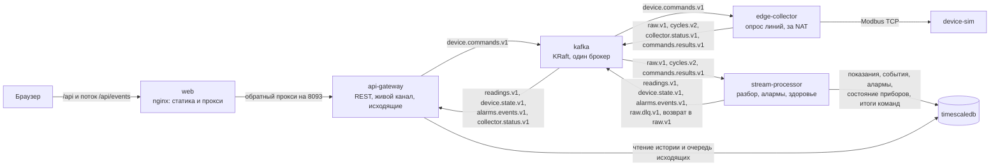
```mermaid
flowchart LR
    BR["Браузер"] -->|"/api и поток /api/events"| WEB["web<br/>nginx: статика и прокси"]
    WEB -->|"обратный прокси на 8093"| GW["api-gateway<br/>REST, живой канал, исходящие"]
    EC["edge-collector<br/>опрос линий, за NAT"] -->|"Modbus TCP"| SIM["device-sim"]
    EC -->|"raw.v1, cycles.v2,<br/>collector.status.v1, commands.results.v1"| K["kafka<br/>KRaft, один брокер"]
    K -->|"device.commands.v1"| EC
    K -->|"raw.v1, cycles.v2, commands.results.v1"| SP["stream-processor<br/>разбор, алармы, здоровье"]
    SP -->|"readings.v1, device.state.v1, alarms.events.v1,<br/>raw.dlq.v1, возврат в raw.v1"| K
    K -->|"readings.v1, device.state.v1,<br/>alarms.events.v1, collector.status.v1"| GW
    GW -->|"device.commands.v1"| K
    SP -->|"показания, события, алармы,<br/>состояние приборов, итоги команд"| DB[("timescaledb")]
    GW -->|"чтение истории и очередь исходящих"| DB
```

Контейнеры стенда и топики между ними (префикс `fieldstream.` и группа в именах опущены). Имена
сервисов как в `infra/compose/docker-compose.yml`, топиков как в `topics.manifest.ts`. У каждого
топика один писатель, исключение одно: возврат кадров из очереди недоставленных в сырой топик.
Разовые `kafka-init`, `migrator` и `seed` отрабатывают до старта сервисов и на схеме не показаны.

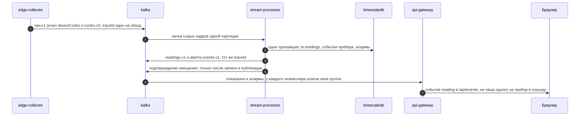
```mermaid
sequenceDiagram
    autonumber
    edge-collector->>kafka: raw.v1 (ключ deviceCode) и cycles.v2, traceId один на обход
    kafka->>stream-processor: пачка сырых кадров одной партиции
    stream-processor->>timescaledb: одна транзакция: ts.readings, события прибора, алармы
    stream-processor->>kafka: readings.v1 и alarms.events.v1, тот же traceId
    stream-processor->>kafka: подтверждение смещения, только после записи и публикации
    kafka->>api-gateway: показания и алармы, у каждого экземпляра шлюза своя группа
    api-gateway->>Браузер: событие reading в /api/events, не чаще одного на прибор в секунду
```

Путь одного обхода от регистров прибора до строки в гипертаблице и события во вкладке. `traceId`
заводится один на обход в `polling/line-worker.ts` и едет дальше заголовком и полем кадра, так что
сырой кадр, цикл опроса, показание и аларм помечены одним значением, а строгий порядок шагов в
процессоре даёт при падении повтор, а не потерю. Автомата состояний у прибора нет: статус и машинная
причина выводятся заново на каждом тике из времени последнего успеха, числа ошибок подряд и
политики (`packages/domain/src/health.ts`), а выше линии `offline` превращается в `unknown`: молчание
приборов не доказывает, что мёртв сам шлюз. Устройство целиком в [ARCHITECTURE](docs/ARCHITECTURE.md),
двенадцать записей о решениях в формате Нюгарда в [docs/adr](docs/adr), их перечень с компромиссами
и ограничениями в [ARCHITECTURE](docs/ARCHITECTURE.md#решения-и-компромиссы).

## Kafka

Имена топиков, ключи, число партиций и настройки объявлены один раз в `topics.manifest.ts`, и из него
же выводятся и конфигурация создания топиков, и типы сообщений: разойтись с реальностью манифест не
может. Ключ выбран по порядку, а не по удобству: у сырых кадров `deviceCode`, у снимков линий
`lineCode`, у команд `siteCode`.

| Тема                                            | Где разобрано                                                                                       |
| ----------------------------------------------- | --------------------------------------------------------------------------------------------------- |
| Топики, ключи, партиции                         | [ARCHITECTURE](docs/ARCHITECTURE.md#топики), [ADR 0002](docs/adr/0002-kafka-bus.md)                 |
| Доставка «не меньше одного раза» и порядок      | [ARCHITECTURE](docs/ARCHITECTURE.md#семантика-доставки), [ADR 0004](docs/adr/0004-at-least-once.md) |
| Очередь недоставленных, ядовитые и внешние сбои | [ARCHITECTURE](docs/ARCHITECTURE.md#отказы)                                                         |
| Перепрогон временной группой                    | [ARCHITECTURE](docs/ARCHITECTURE.md#переигрывание-истории)                                          |
| Отставание как наблюдаемая величина             | [ARCHITECTURE](docs/ARCHITECTURE.md#отставание-консьюмера)                                          |
| Эволюция схем и почему нет реестра              | [ARCHITECTURE](docs/ARCHITECTURE.md#эволюция-схем), [ADR 0003](docs/adr/0003-zod-contracts.md)      |
| Когда Kafka здесь была бы лишней                | [ARCHITECTURE](docs/ARCHITECTURE.md#когда-kafka-здесь-была-бы-лишней)                               |

Поведение брокера проверено прогонами на учебных топиках в `tools/kafka-lab`: восемь опытов, вопросы
и ответы числами в [записной книжке](docs/kafka-notebook.md).
Один опыт: `pnpm --filter @fieldstream/kafka-lab run lab order`.

## Хранилище

Одна база на TimescaleDB, две прикладные схемы и три роли с разными правами: `fs_migrator` владеет
схемами, `fs_ingest` пишет телеметрию, а `fs_api` телеметрию только читает и пишет лишь в свои
служебные таблицы (сессии обновления, вёдра ограничителя, уставки и их журнал, подтверждения
алармов, очередь исходящих, прогоны сценариев и постановку перепрогона), причём в перепрогоне
только по перечисленным колонкам; права выписаны поимённо рядом с таблицами в
`packages/db/migrations` ([разбор](docs/ARCHITECTURE.md#роли)). В схеме: узкая форма гипертаблицы
показаний и уникальный индекс, служащий ключом идемпотентности; двухуровневые агрегаты на сумме и
количестве; сжатие с двух суток и хранение 30 суток при инварианте «боевой конвейер не пишет в
сжатый кусок». Всё с обоснованием и цифрами объёма в
[ARCHITECTURE](docs/ARCHITECTURE.md#модель-данных), [ADR 0005](docs/adr/0005-timescaledb-schema.md),
[ADR 0006](docs/adr/0006-continuous-aggregates.md), [ADR 0008](docs/adr/0008-sql-without-orm.md).

## Фронтенд

React 19, строгий TypeScript, Vite, MUI для каркаса, SCSS-модули по БЭМ, uPlot для временных рядов,
TanStack Query для серверного состояния; почему так и что из этого следует, разобрано в
[ARCHITECTURE](docs/ARCHITECTURE.md#фронтенд) и [ADR 0011](docs/adr/0011-uplot.md). Здесь только то,
что нужно знать при правках: весь интерфейс спрашивает «сейчас» только у
`shared/time/serverClock.ts`, прямое обращение к системным часам запрещено правилом линтера в
`eslint.config.js`, на сервере ту же роль играет порт `packages/domain/src/clock.ts`. Права решают,
какие вкладки видны, но последнее слово за сервером: прямой заход по адресу закрытой вкладки
отрисует экран и покажет «Нет доступа» по ответу 403, а не по второй копии правил в браузере. Вместо
протухших данных рисуется прочерк, и у каждого экрана есть рабочие состояния: скелетоны
фиксированной высоты, пусто, ошибка с различением «сервер недоступен» и «сессия отозвана»,
устаревшие данные, недоступность живого канала.

Чего в интерфейсе нет: навигации по строкам таблицы с клавиатуры, разбиения бандла по маршрутам
(один файл 1.0 МБ, 320 КБ в gzip, предупреждение Vite о размере не подавлено), автоматической проверки
раскладки на узких экранах ([список пропусков](docs/ARCHITECTURE.md#состояния-адаптивность-и-доступность)).

## Замеры

Числа снимает `pnpm bench` (`tools/bench`) с поднятого стенда, и каждая строка отчёта печатается
вместе с командой, которой ту же цифру берут руками. Замеров восемь: темп записи, задержка до
события живого канала, отставание групп, память и процессор, размеры образов и томов, сжатие кусков,
время выборок серии; ключ `--load` переводит линии на частый такт штатной командой и возвращает
прежний даже при срыве прогона. Полная таблица с оговорками лежит в одном месте,
[docs/STAND.md](docs/STAND.md#замеры); четыре опорных строки оттуда:

| Что                                      | Значение                                                   | Чем повторить                                 |
| ---------------------------------------- | ---------------------------------------------------------- | --------------------------------------------- |
| Темп записи под наведённой нагрузкой     | 216.3 строк/с при такте 1 с, расчёт по топологии 216.0     | `pnpm bench throughput --load --load-ms 1000` |
| Задержка кадра до события живого канала  | p50 4 мс, p95 7 мс на выборке 120 кадров                   | `pnpm bench latency`                          |
| Сжатие `ts.readings` на засеянной неделе | 337 МиБ до, 12.6 МиБ после, 26.7x, восемь кусков из девяти | `pnpm bench compression`                      |
| Запрос серии на окне 7 суток             | сырые 8.5 мс, минутный агрегат 30 мс, часовой 6.3 мс       | `pnpm bench query`                            |

Что означает первая строка: замер считает строки, попавшие в `ts.readings` за окно, и сравнивает их
с расчётным темпом по топологии из `core.lines` и `core.metric_defs`, то есть 216.3 против 216.0 значит
только, что писатель успел за поданной нагрузкой. Потолок писателя этим не измерен.

## Тесты

```bash
pnpm test             # 1163 случая в 122 файлах, включая проверку границ зависимостей
pnpm test:integration # 108 случаев в 14 файлах на настоящих Kafka и TimescaleDB, нужен Docker
pnpm --filter @fieldstream/web e2e  # 24 сценария Playwright против поднятого стенда
```

Из первой команды 192 случая в 19 файлах это интерфейс в jsdom: экраны целиком с поддельной сетью и
поддельными часами; время везде инжектируется, реального ожидания нет ни в одном тесте. Что проверяет
каждый слой, ради каких восьми утверждений заведён интеграционный и какая дыра названа отдельно,
написано в [ARCHITECTURE](docs/ARCHITECTURE.md#тестирование).

## Решения под пересмотр

Список недоделок лежит в [ARCHITECTURE](docs/ARCHITECTURE.md#известные-ограничения). Здесь другое:
решения, которые стоит пересмотреть, и условие, при котором прежнее остаётся правильным.

- **Состояние приборов держал бы в обычном топике, а не в компактируемом.** `device.state.v1`
  объявлен `compact`, но его единственный потребитель подписывается с `fromBeginning: false`
  (`events/kafka-bridge.service.ts`), а снимок при старте шлюз поднимает из `core.device_state`:
  компакция не восстанавливает ничего, а надгробий система не пишет, поэтому снятый прибор остаётся
  в топике навсегда. Решение осталось бы прежним, перестань состояние дублироваться в базе.
- **Декодирование вынес бы на сборщик.** Он уже держит профили (`buildDeviceReadPlan` в
  `polling/line-worker.ts`), и `decodeFrame` из того же пакета стоил бы одной строки импорта. Сырые
  кадры оправданы ровно одним: возможностью перепрогнать историю исправленным декодером, а такого
  режима здесь нет. Решение остаётся прежним, пока профили и кодек меняются: сырые байты это
  единственный способ починить историю задним числом.
- **На реальном объёме ушёл бы с JSON на бинарный формат и реестр схем.** `encodeMessage` это
  `JSON.stringify` (`packages/kafka/src/message.ts`), а `zod` уезжает в браузерный бандл вместе с
  контрактами. Размер не единственная цена: машинной проверки совместимости схем нет
  ([ADR 0003](docs/adr/0003-zod-contracts.md)). Пока все потребители на TypeScript, контейнер на JVM
  рядом с брокером не окупается; первый же потребитель не на TypeScript переворачивает счёт.
- **Топологию хранил бы в базе, а не константой в коде.** `DEMO_STAND`
  (`packages/device-profiles/src/stand.ts`) это единственный источник правды о площадках, шлюзах,
  линиях и приборах для симулятора, сборщика, процессора и мигратора, и новый прибор означает
  пересборку трёх образов. Взамен `defineStand` проверяет описание при сборке; решение поменялось
  бы, когда приборы начинает заводить оператор.
- **Взял бы очередь попроще, если бы не перепрогон и не партиции.** По нагрузке Kafka здесь
  избыточна, оправдана четырьмя свойствами ([разбор](docs/ARCHITECTURE.md#когда-kafka-здесь-была-бы-лишней)), а
  долю брокера в памяти и томах показывают строки «Память» и «Тома» в
  [таблице замеров](docs/STAND.md#замеры). Исчезни перепрогон и требование порядка при
  нескольких процессорах, выбором стали бы Redis Streams или таблица в Postgres.
- **Не заводил бы агрегат, который никто не читает, и не писал бы одно правило дважды.** Агрегат
  `ts.poll_cycles_5m` и представление `ts.device_timeout_hint` заведены миграцией `0005` и не
  читаются ни одним сервисом, а правило таймаута записано и в SQL представления, и в TypeScript
  сборщика (`polling/latency.ts`). Числа совпадают, потому что их сверял человек. Исходов два:
  либо шлюз отдаёт подсказку на экран, либо агрегат уезжает из миграций.
- **Объявлял бы заголовки сообщений в манифесте наравне с телом.** Схемой проверяются тело и
  конверт, но не заголовки: `x-trace-id` у состояния прибора несёт код прибора вместо
  идентификатора трассы, а `x-dlq-attempt` меняет путь кадра через процессор и проверяется руками.
  Заголовки можно оставлять без проверки, пока ни один из них ни на что не влияет, а это
  условие уже не выполняется.

## Как это масштабируется

Три сценария роста для этого кода: что упрётся первым и чем лечится.

**Приборов в двадцать раз больше (24 -> 480).** Первым упрётся справочник кодов, а не запись:
`lineCodeSchema` это `/^L\d$/`, а `core.lines.code` объявлена `UNIQUE` глобально, то есть линий может
быть десять, тогда как шесть приборов на линию превращают 480 приборов в 80 линий; туда же топология
из `DEMO_STAND`. Линия растёт вширь, а не вглубь: обход последовательный, приборы добавляются новыми
линиями, а запас внутри линии даёт склейка блоков. Про запись в гипертаблицу известно меньше, чем
хотелось бы: расчётно нужно 432 строки в секунду (480 приборов по 9 метрик раз в 10 секунд), а
замерено другое, что при такте 1 секунда писатель успевал за поданными 216 строками в секунду без
признаков отставания (`pnpm bench throughput --load --load-ms 1000`). Это не потолок, и потолок здесь
не измерялся; для вдвое большего темпа нужен прогон на такте 0.5 секунды, которого не было. Дальше
упрётся диск: 300 МБ горячих суток становятся 6 ГБ, а 0.9 ГБ на 30 суток порядка 18 ГБ
([Объём](docs/ARCHITECTURE.md#объём)), и здесь впервые по-настоящему начинают работать политики
сжатия и хранения из миграции `0006`, которых не исполняет ни один тест. Экземпляров процессора может
быть столько, сколько партиций у сырого топика, сейчас шесть, и увеличение их числа это новая
мажорная версия топика. Обзорный запрос сканирует час `ts.readings` по всем приборам
(`packages/db/src/store/read.ts`): сейчас порядка 78 тысяч строк, при 480 около полутора миллионов,
и лечится колонкой последнего значения в `core.device_state`.

**Площадок больше.** Сборщик на площадку это уже рабочая модель: линии делятся переменной
`COLLECTOR_LINES`, воркеры поднимаются только своих линий, наружу у сборщика только исходящее
соединение к брокеру ([edge-collector](docs/ARCHITECTURE.md#edge-collector)). Упрётся тот же
справочник: `siteCodeSchema` это `/^SITE-[A-Z]$/`, двадцать шесть площадок, а `gatewayCodeSchema`
это `/^GW-\d{2}$/`, сто шлюзов. Топик `device.commands.v1` разложен по коду площадки на три партиции,
и манифест прямо оговаривает: при десятках площадок правильнее топик на площадку. Снимки линий
каждый экземпляр шлюза читает с начала, то есть держит в памяти все линии всех площадок; дерево
здоровья строится в памяти процессора сразу по всему стенду и снова из `DEMO_STAND`.

**Пользователей больше.** Живой канал это одно соединение SSE на вкладку, шина это один `Subject`, и
каждое событие проходит проверку прав и ключей подписки у каждого подписчика
(`events/live-bus.service.ts`): цена линейна по произведению числа вкладок на темп событий, и всё в
одном цикле событий Node. Кольцо досылки одно на экземпляр и общее для всех подписок, по умолчанию
5000 событий (`SSE_RING_SIZE`): при 24 приборах это около трёх минут истории, при 480 около десяти
секунд, и уснувшая вкладка начнёт получать `resync`. Второй экземпляр шлюза поднимается, но требует
липких сессий: в памяти живёт и кольцо ([ADR 0007](docs/adr/0007-sse-ring-buffer.md)), и окно
повтора обновления токена (`auth/auth.service.ts`), поэтому повтор на соседнем экземпляре будет
расценен как кража токена. Группа у каждого шлюза своя, `fs-api-<id>`, значит N экземпляров это N
полных копий потока. Чтение истории от числа пользователей почти не зависит, зато просроченные
сессии и вёдра ограничителя не удаляются никогда.

## Чего здесь сознательно нет

[Полный список](docs/ARCHITECTURE.md#чего-здесь-сознательно-нет) с обоснованием каждого пункта лежит
в ARCHITECTURE. Коротко: реестра схем с бинарным форматом, кластера брокеров, Kubernetes, Prometheus
и Grafana в базовом составе (метрики отдаются); транзакций брокера, точной доставки, отложенных
повторов и Kafka Streams; отдельной базы на сервис, отдельных сервисов алармов, агрегации и
авторизации, событийного хранения и распределённой трассировки; применения правки перепрогона к
боевым уставкам и прогона исправленным декодером; мобильного приложения, серверного рендеринга и
локализации; своего клиента Modbus (свой здесь только сервер стенда, ради поломок в кадре).

## Разработка

Образы для ежедневной работы пересобирать не нужно: `pnpm infra:up` поднимает брокер, базу и
применяет миграции, а `pnpm dev` запускает сервисы на хосте в режиме наблюдения за файлами. Фронт
живёт на дев-сервере vite (5173), но браузер остаётся в одном origin и здесь: код фронта ходит
относительными путями `/api`, а перекладывает их в шлюз на 8093 прокси самого vite
(`apps/web/vite.config.ts`); `CORS_ORIGINS` в `.env` нужен, только если ходить в шлюз мимо прокси.

```bash
pnpm install
pnpm build            # turbo, сборка всех пакетов; типы веба проверяет её шаг tsc --noEmit
pnpm test             # vitest по пакетам, включая проверку границ зависимостей
pnpm test:integration # четыре пакета на настоящих TimescaleDB и Kafka в контейнерах, нужен Docker
pnpm typecheck        # типы пакетов, сервисов и инструментов вместе с их тестами
pnpm lint             # eslint, включая тестовые файлы
pnpm format:check     # prettier
pnpm topics:gen       # пересобрать infra/kafka/topics.conf из манифеста топиков
```

Монорепа разложена по четырём корням: `packages/` (contracts, modbus-codec, device-profiles, domain,
kafka, db, nest-common, scenarios), `services/` (device-sim, edge-collector, stream-processor,
api-gateway), `apps/web` и вспомогательные `infra/`, `tools/`, `docs/`; назначение каждого и полное
дерево в [ARCHITECTURE](docs/ARCHITECTURE.md#дерево-каталогов). Границы зависимостей держатся на трёх
уровнях: ссылки между проектами в компиляторе, зоны `no-restricted-imports` в линтере и
`dependency-cruiser` обычным тестом (`tools/arch-check`) и отдельным шагом CI.

**Добавить новую модель прибора.** Профиль это данные, а не код: один файл и три строки в каталоге,
правок в сервисах ноль. Описание через `defineDeviceProfile` и список кодов ложатся в
`packages/device-profiles/src/profiles/<модель>.ts` (валидатор строгий и падает на сборке, а не на
линии); три строки в `profiles/catalog.ts` это импорт, профиль в `DEVICE_PROFILES` и коды в
`PROFILE_BY_DEVICE_CODE`; приборы добавляются в `DEMO_STAND`
(`packages/device-profiles/src/stand.ts`), где `defineStand`
сверяет ключ модели с каталогом; по желанию стартовые уставки идут в `DEFAULT_ALARM_RULES`
(`packages/device-profiles/src/alarm-defaults.ts`), которые мигратор переносит в базу и больше не
затирает. Дальше писать нечего: план чтения, декодер, карта регистров симулятора, топология в базе и
подписи в интерфейсе берутся из того же профиля. Остаётся `pnpm stack:up`.

## Происхождение и лицензия

Лицензия MIT. Домен, площадки, шлюзы, приборы, их коды и все данные вымышленные, адреса взяты из
документационного диапазона RFC 5737. Физика и протокол настоящие: RS-485, Modbus и особенности
опроса устроены именно так. Внутренних материалов и имён реальных компаний в репозитории нет.
